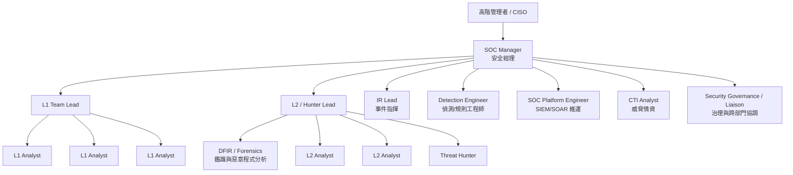

# User / Team

# 組織結構圖（中型 SOC 版本）

- **中型以上組織（進階版）：**
    - SOC Manager + Shift Lead
    - L1 班表（輪班）
    - L2 / L3（進階分析 + Hunter）
    - 專職 IR Lead / DFIR
    - Detection Engineer / Content Engineer
    - Platform Engineer（SIEM/SOAR）
    - CTI Analyst

- **最小可行 SOC（小型 / 剛起步）：**
    - SOC Manager（兼 Team Lead）
    - 2–3 個 L1
    - 1–2 個 L2（兼 Hunter、兼 IR handler，同一批資深分析師兼做）
    - 1 個 Platform / Detection Engineer（技術支援型 SOC 工程師，可兼職或外包）
    - **DFIR**：平常不設專職，需要時找外部顧問 / MSSP
    - **CTI / Governance**：由 Manager 或資深 L2 兼職

---

# 角色一覽

| 角色 | 工作概述 | 備註 |
| --- | --- | --- |
| **Manager / SOC Manager (Mgr)** | SOC 營運、預算、KPI、匯報管理階層 |  |
| **L1 Analyst (L1)** | 24x7 監控、告警分流、初判、依 runbook 進行升級或結案 |  |
| **L2 Analyst (L2)** | 進階分析、關聯多個來源 log、調查 lateral movement、提出處置建議 |  |
| **Threat Hunter (Hun)** | 主動獵捕、根據攻擊 TTP、Threat Intel，在環境裡找「還沒被觸發成告警」的異常 |  |
| **IR Lead (IR)** | 重大事件指揮、跨部門協調（IT、法務、公關、營運）、決定隔離／關聯系統、對外溝通 | 中大型組織強烈建議獨立角色 |
| **Detection Engineer (Det)** | 撰寫維護 SIEM/EDR 規則與關聯、Use Case、偵測 coverage | 解決告警太吵、偵測 coverage 不足、TTP 沒被覆蓋等問題，假如沒這個角色，L1 / L2 會被一堆爛 alert 淹死 |
| **Platform Engineer (Plat)** | 平台維運與整合（SIEM / SOAR / 日誌 / 情資 / Ticketing 等） | 跟 Infra / DevOps 互動，確保 log 落地、性能、可用性。假如沒這角色，藍隊會一直卡在工具不好用、資料收不齊 |
| **DFIR / Forensics (DFIR)** | 進階事件鑑識、惡意程式分析、分析與判斷攻擊範圍與持續性、重大事件支援 | 常與 IR Lead / Threat Hunter 緊密配合，較成熟環境會至少有 1–2 位這樣的專家（或外包顧問） |
| **CTI Analyst (CTI)** | 外部威脅情資蒐集、整理、內化為可落地的偵測掃描規則 | 沒 CTI 也活得下去，但 Hunter / Detection Engineer 會比較辛苦 |
| **Governance / Liaison (Gov)** | 對接 GRC / Audit、與 IT / 業務部門溝通 | 小公司可能由 Manager 兼任；大組織會有 Security Program Manager / Governance 專職 |

---

# 藍隊 RACI 分配

> R = Responsible（執行）
> 
> 
> A = Accountable（負最終責任）
> 
> C = Consulted（被諮詢）
> 
> I = Informed（被通知）
> 

## 日常監控與告警流程

| 活動 / 任務 | Mgr | L1 | L2 | Hun | IR | Det | Plat | DFIR | CTI | Gov |
| --- | --- | --- | --- | --- | --- | --- | --- | --- | --- | --- |
| 24x7 告警監控與初判 | I | R | C | I | I | I | I | I | I | I |
| 告警分流與升級 (Escalation) | I | R | C | I | C | I | I | I | I | I |
| 事件進一步調查與關聯分析 | I | C | R | C | C | I | I | C | C | I |
| 誤報 / 誤觸發分析與回饋 | I | R | R | C | I | C | I | I | I | I |
| 日／週報表產出（告警量、SLA、趨勢） | A/R | C | C | I | I | I | I | I | I | C |

## 偵測規則與平台維運

| 活動 / 任務 | Mgr | L1 | L2 | Hun | IR | Det | Plat | DFIR | CTI | Gov |
| --- | --- | --- | --- | --- | --- | --- | --- | --- | --- | --- |
| 新增 / 調整 SIEM 規則 | I | C | C | C | I | R | C | C | C | I |
| 維護 Use Case / Detection Roadmap | A | I | C | C | C | R | C | C | C | C |
| SIEM / SOAR 平台維運 / 效能調校 | I | I | I | I | I | C | R | I | I | I |
| 新增 log source / data pipeline | I | I | C | I | I | C | R | I | C | C |

## Threat Hunting 與威脅情資

| 活動 / 任務 | Mgr | L1 | L2 | Hun | IR | Det | Plat | DFIR | CTI | Gov |
| --- | --- | --- | --- | --- | --- | --- | --- | --- | --- | --- |
| 制訂年度 / 季度 Threat Hunting 計畫 | A | I | C | R | C | C | I | C | C | C |
| 執行 Hunting 任務 | I | I | C | R | I | C | C | C | C | I |
| 接收與彙整外部情資 (ISAC, CERT 等) | I | I | I | C | I | I | I | I | R | C |
| 將情資轉成規則 / 偵測 Use Case | I | I | C | C | I | R | C | C | C | I |

## 事件應變（IR / DFIR）

| 活動 / 任務 | Mgr | L1 | L2 | Hun | IR | Det | Plat | DFIR | CTI | Gov |
| --- | --- | --- | --- | --- | --- | --- | --- | --- | --- | --- |
| 事件分級（Severity / Impact） | I | C | C | C | A/R | I | I | C | C | C |
| 事件指揮與決策（隔離、封鎖、關閉系統） | I | I | C | C | A/R | C | C | C | C | C |
| 鑑識（Disk / Memory / Malware） | I | I | C | C | C | I | I | R | C | I |
| 事後檢討（Post-Incident Review / Lesson Learned） | A | C | C | C | R | C | C | C | C | C |
| 對內／對外溝通（管理層、法務、公關等） | A | I | I | I | C | I | I | I | I | R |

---